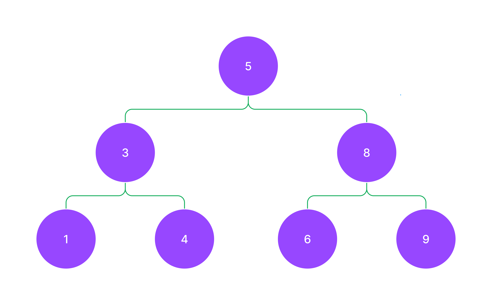

- 현재 repo 주소: https://github.com/paullabkorea/Algorithm-walk-with-wenivs
- 이력서 템플릿: https://paullabworkspace.notion.site/Figma-bfa32213fc244db9b31bb8486a479ee6?pvs=4

# 1. 자료구조와 알고리즘, 코딩테스트

- 자료구조(자료를 어떻게 담는가?): array, object, map, set, 싱글 링크드 리스트, 더블 링크드 리스트, 트리, 해쉬 등
- 알고리즘(문제를 어떻게 풀 것인가?): 애라토스테네스의 체, 그리디 알고리즘, 투 포인터, 슬라이딩 윈도우 등
- 자료구조 + 알고리즘 => 문제 풀이 능력을 보겠다! => 코딩테스트
- 추천 서적
  - 학문적 접근: The Art of Computer Programming(도널드 커누스)
  - 코딩테스트 접근: 파이썬 알고리즘 인터뷰(박상길)
  - 자바스크립트 코딩 테스트 책: 코딩 테스트 합격자 되기 - 자바스크립트 편
- 요즘은 ChatGPT가 이러한 책의 역할을 하고 있습니다. 그래서 https://100.jsalgo.co.kr/ 와 같은 곳에서 문제를 풀어보시면서 자료구조와 알고리즘을 설명해달라고 ChatGPT에게 요청하시면서 공부하시는 방법이 더 효율적입니다.

## 1.1 코테 전 준비사항

1. 회사와 경향 분석!
   - 코테 보는 회사와 회사 유형을 정리하세요.
   - [코딩테스트 경향 정리](https://paullabworkspace.notion.site/446d03bf38df42e19d9fedcf5ceaec61?pvs=4) 해두었습니다.
   - 분석 서비스를 통해 [출제 경향](https://algoview.co.kr/)도 한 번 정리하세요.
2. 플렛폼에 익숙해지자! (프로그래머스, 구름EDU 등)
   - 사용 가능 라이브러리 미리 확인 등
   - 대부분 numpy나 pandas가 사용 가능하지만 간혹가다 라이브러리 제한이 있는 곳도 있습니다. numpy는 python보다 대부분의 경우 속도가 빠릅니다. 크기에 따라 다르지만 100000개 이상의 배열의 연산의 경우 50배 이상의 성능을 보입니다. 순열과 조합은 itertools를 사용하시면 python 아주 쉽게 풀 수 있습니다.
3. 언어 선택(속도 : C++, 풀이 : Python)
   - 요즘은 Lv이 높은 경우가 아니면 속도 체크를 거의 하지 않는 추세입니다.
   - 다른 언어가 메인이셔도 Python 추천 드립니다. 코딩테스트만을 위해 Python을 새로 공부하시는 분들이 많습니다.
4. 코드 스니펫(트리, 검색, 최단경로(예를 들어 다익스트라), 직접 제작한 함수 등), Cheatsheet, A4 용지 준비
   - 코드 스니펫을 만들어둔 레파지토리 fork - [제주코딩베이스캠프](https://github.com/paullabkorea/programmersLv0)
   - 감독관이 없는 경우 [스니펫](https://github.com/paullabkorea/programmersLv0/blob/main/Solution.md)에서 Ctrl + F해서 문제를 풉니다.
   - 시험 전 스니펫을 만들지 말고 하루 한 문제씩(저도 매일 한 문제씩 풉니다.) 또는 버겁다면 일주일에 2 ~ 3문제.
5. 유용한 라이브러리 정리! (collections, itertools(순열, 조합), functools, re, bisect, math 등) - [제주코딩베이스캠프](https://www.youtube.com/channel/UC4GnvNKtuJ4cqWsYjxNxAEQ) 유튜브 채널 확인
   - 유용한 알고리즘 GitHub repo를 검색하고 fork를 떠두는 것도 좋습니다.
   - 면접질문 repo등 다양한 목적에 repo가 있습니다.
6. 기억해두자! 예외처리!
   - 예외처리와 테스트 케이스중 통과 못하는 케이스들은 문제를 많이 풀어보셔야 합니다.
   - 길이가 0이거나 0으로 나누거나 등
7. 속도개선
   - class로 구현
   - 메서드 대신 슬라이싱 구현(슬라이싱은 C로 구현되어 있어 메서드보다 통상 8배정도 빠릅니다.)하세요. 다만 공간복잡도가 상승할 수 있습니다. (리스트.reverse(), reversed(리스트), 리스트[::-1])
   - for문 대신 list comprehension을 사용하세요. 더 빠릅니다.
   - 재귀는 느립니다. 최후의 수단으로 사용하세요.
8. ChatGPT, Copilot 활용
   - 감독관이 없고 검색이 가능하다면 ChatGPT를 활용하세요.(ChatGPT가 활용 불가인 코테도 있습니다. 다만 활용 불가인데 검색이 가능할 경우 형평성 문제가 생겨요.)
   - ChatGPT 나오고 화이트보드 테스트가 많아졌습니다.

## 1.2 문제 유형과 출제 방식

- 5 ~ 6시간, 6 ~ 7문제
  - 구현 테스트의 경우에는 짧으면 1일 길면 4 ~ 5일 주는 경우도 있습니다.
- 30분씩 4문제, 2시간씩 2문제
- 2 ~ 3시간, 3 ~ 5문제
- 30분씩 3 ~ 4문제, 변별력 1문제
- 단기 공부로 붙을 수 있는 코테와 붙기 힘든 코테 경향 정리
- 문제 유형 분석 관련 글
  - [문제 유형 분석](https://www.hanbit.co.kr/media/channel/view.html?cms_code=CMS4385594264)
  - [언어 유불리 여부](https://www.hanbit.co.kr/media/channel/view.html?cms_code=CMS9145550324&cate_cd=)
  - [코딩 테스트에 가장 많이 출제 되는 알고리즘](https://www.hanbit.co.kr/media/channel/view.html?cms_code=CMS7793635735&cate_cd=)
    - 요구사항 구현 알고리즘(33%)
    - 그리디 알고리즘(20%)
    - 너비우선탐색, 깊이우선탐색(20%)
    - 정렬(8%)
    - 다이나믹 프로그래밍, 최단경로, 이진 탐색 등
- 전체 문제 유형
  - 알고리즘
    - 정렬
    - 이진 검색
    - 비트 연산
    - 슬라이딩 윈도우, 페이지 교체
    - 분할 정복
      - 그리디 알고리즘
      - 다이나믹 프로그래밍
  - 자료구조
    - 선형
      - 스택과 큐, 데크
      - 연결리스트, 해시 테이블
    - 비선형
      - 그래프(최단경로) - 다익스트라가 나오면 매우 어려운 문제
      - 트리
        - 힙
        - 트라이

## 1.3 간단한 코드 스니펫

```js
// 1. python에서 유용한 코드를 js 모듈화

// 1.1. 묶음
const zip = (a, b) => a.map((e, i) => [e, b[i]]);
// 제약조건: a가 map을 사용하기 위해 array여야 합니다.

// 1.2. 범위안에 수 생성
const range = (start, end) => Array.from({length: end - start + 1}, (_, i) => start + i);

Array.from('hello'); // ['h', 'e', 'l', 'l', 'o']
Array.from({'one':10, 'two':20}, (v, i) => i); // [0, 1, 2, 3, 4]
Array.from({1, 2, 3});
Array.from([1, 2, 3]);
Array.from(new Set([1, 2, 3]));
Array.from(new Map([[1, 2], [3, 4]]));

Array.from([1, 2, 3], x => x + x); // [2, 4, 6]
Array.from('hello', x => x + x); // ['hh', 'ee', 'll', 'll', 'oo']

// 1.3. 평평하게 만들기(평탄화)
// [1, [2, [3, [4]]]] => [1, 2, 3, 4]
const flatten = (arr, depth = Infinity) => arr.flat(depth);

[1, [2, [3, [4]]]].flat()
[1, [2, [3, [4]]]].flat(1)
[1, [2, [3, [4]]]].flat(2)
[1, [2, [3, [4]]]].flat(3)
[1, [2, [3, [4]]]].flat(Infinity)


// 2. js에서 사용할 유용한 코드
Array(5).fill(0); // [0, 0, 0, 0, 0]
Array(5).fill(0).map((v, i) => i); // [0, 1, 2, 3, 4]
Array(5).fill(0).map((v, i) => i+1); // [1, 2, 3, 4, 5]
'.'.repeat(5)
'.'.repeat(5).split('.') // 권하진 않습니다.
Array.from('ab'.repeat(5))

Infinity
-Infinity

Math.ceil(1.1); // 올림
Math.floor(1.1); // 내림
Math.max(1, 2, 3, 4, 5);
Math.max([1, 2, 3, 4, 5]);
Math.max(...[1, 2, 3, 4, 5]); // 이렇게 종종 사용합니다.

parseInt('1234', 10); // 10진수 1234를 10진수로 변환
parseInt('1001', 2); // 2진수 1001을 10진수로 변환
parseInt('12aa34.abc'); // 12까지 변환, 안전합니다.

Math.floor(10 / 3);
~~(10 / 3) // 안전한 parseInt 연산을 사용하세요.
10 / 3 | 0 // 안전한 parseInt 연산을 사용하세요.
10 / 3 << 0 // 안전한 parseInt 연산을 사용하세요.

2 << 2 // 8
// step1 왼쪽에 있는 2를 2진수로 변환합니다. 10이 됩니다.
// step2 10을 왼쪽으로 2칸 이동합니다. 1000이 됩니다.
// step3 1000을 10진수로 변환합니다. 8이 됩니다.

5 << 3
// step1 왼쪽에 있는 5를 2진수로 변환합니다. 101이 됩니다.
// step2 101을 왼쪽으로 3칸 이동합니다. 101000이 됩니다.
// step3 101000을 10진수로 변환합니다. 40이 됩니다.

(1234.56789).toFixed(2); // 1234.57
(1234.56789).toFixed(0); // 1235
(1234.56789).toFixed(4); // 1234.5679
(1234.56789).toFixed(6); // 1234.567890

// match는 문자열에서 정규식을 사용할 수 있습니다.
'2345678910111213'.match(/1/g) // g는 global이에요. 전역에서 찾겠다는 것입니다. 앞에 슬러시와 뒤에 슬러시는 정규식을 사용할 때 사용합니다.
'2345678910111213'.match('1')
'2345678910111213'.match(/1/)
'2345678910111213'.match(/1/g)
'2345678910111213'.match(/1/g).length
'hello leehojun my name hojun'.match(/hojun/g).length
```

## 1.4 2진수, 8진수, 16진수, 10진수

```js
// 2진수: 숫자를 2개만 사용합니다.
// 0, 1, 10, 11, 100, 101, 110, 111, 1000, 1001, 1010

// 8진수: 숫자를 8개만 사용합니다.
// 0, 1, 2, 3, 4, 5, 6, 7, 10

// 16진수: 숫자를 16개만 사용합니다.
// 0, 1, 2, 3, 4, 5, 6, 7, 8, 9, A, B, C, D, E, F, 10

// 10진수: 숫자를 10개만 사용합니다.
// 0, 1, 2, 3, 4, 5, 6, 7, 8, 9, 10

// 아주 쉽게 10진수를 2진수로 변환하는 방법
// 9를 2진수로 표현해주세요!
// step1 9와 가장 가까운 2의 제곱수를 찾습니다. 2^3 = 8 이 수의 형태는 항상 10000...형태가 됩니다. 1000
// step2 8에서 몇을 더하면 9가 되는지 찾습니다. 1만 더하면 됩니다. 1001
```

## 1.5 워밍업 문제 1

- 링크: https://codingdojang.com/scode/393

```js
// 이렇게 풀지 마세요 - 1
// xxx8:000 ~ 999개
// xx8x:000 ~ 999개
// x8xx:000 ~ 999개
// 8xxx:000 ~ 999개
// 중복 => 중복을 허락해야 합니다. 4000개가 답이 맞습니다.
// 이런식으로 풀이하는 것을 보려고 하는 문제가 아닙니다!

// 이렇게 풀지 마세요 - 2
// 이런 카운팅 하는 문제에 lv1문제는 대부분 문자열 문제입니다.
// [0, 0, 0, 0] ~ [9, 9, 9, 9] 반복을 돌며 풀지 마세요.

// 이렇게 풀지 마세요 - 3
count = 0;
for (let i of "12345678910111213") {
  console.log(i);
  if (i === "1") {
    count++;
  }
}
count;

// 최대한 내장 메서드를 이용해주세요.
// 효율적으로 풀 수 있는 방법을 찾아주세요.

"12345678910111213".match(/1/g).length;

Array(100)
  .fill(0)
  .map((_, i) => i);

Array(100)
  .fill(0)
  .map((_, i) => i)
  .join("");

Array(100)
  .fill(0)
  .map((_, i) => i)
  .join("")
  .split("")
  .filter((v) => v === "1");

Array(100)
  .fill(0)
  .map((_, i) => i)
  .join("")
  .split("")
  .filter((v) => v === "1").length;

// 모든 것을 다 한줄로 만들려는 것은 좋지 않습니다.

Array(100)
  .fill(0)
  .map((_, i) => i)
  .join("")
  .match(/1/g).length;
```

## 1.6 워밍업 문제 2

- 링크: https://codingdojang.com/scode/408
- 순서쌍, 최댓값, 최솟값, 특정값의 정렬 문제는 모두 정렬문제입니다.

```js
const s = [1, 3, 4, 8, 13, 17, 20];

// 이렇게 풀지 마세요 - 1
let min = Infinity;
let index = 0;
for (let i = 0; i < s.length - 1; i++) {
  console.log(s[i + 1] - s[i]);
  if (s[i + 1] - s[i] < min) {
    min = s[i + 1] - s[i];
    index = i;
  }
}

console.log(s[index], s[index + 1]);

// 최솟값: 최댓값을 먼저 저장해야합니다.
// 최댓값: 최솟값을 먼저 저장해야합니다.

////////////////

// 이렇게 풀면 간단합니다.
const s = [1, 3, 4, 8, 13, 17, 20];
const zip = (a, b) => a.map((e, i) => [e, b[i]]);
const pair = zip(s, s.slice(1));

// 이 상태에서 정렬을 하고 최솟값을 찾으면 됩니다.
pair.sort((a, b) => a[1] - a[0] - (b[1] - b[0]));
pair.sort((a, b) => a[1] - a[0] - (b[1] - b[0]))[0];

////////////////

const s = [1, 3, 4, 8, 13, 17, 20];
const zip = (a, b) => a.map((e, i) => [e, b[i]]);
const pair = zip(s, s.slice(1));
let min = Infinity;
let result = [];

for (let [i, j] of pair) {
  console.log(i, j);
  if (j - i < min) {
    min = j - i;
    result = [i, j];
  }
}

console.log(result);
```

## 1.7 워밍업 문제 3

- 링크: https://100.jsalgo.co.kr/?page=4#

```js
// ['쿠키 3개', '쿠키 2개', '쿠키 5개']
// 3 X 1 + 2 X 2 + 5 X 3 = 3 + 4 + 15 = 22

const cookies = ["쿠키 3개", "쿠키 2개", "쿠키 5개"];

function solution(data) {
  data.forEach((v) => {
    console.log(v);
    // console.log(parseInt(v))
    // 숫자가 먼저 나오지 않으면 못찾습니다.
  });
}

solution(cookies);

////////////////

const cookies = ["쿠키 3개", "쿠키 2개", "쿠키 5개"];

function solution(data) {
  let result = 0;
  let temp = 1;
  data.forEach((v) => {
    console.log(v.match(/\d+/g));
    result += parseInt(v.match(/\d+/g)[0]) * temp;
    temp++;
  });
  return result;
}

solution(cookies);

////////////////

const cookies = ["쿠키 3개", "쿠키 2개", "쿠키 5개"];

function solution(data) {
  let result = 0;
  let temp = 1;
  data.forEach((v) => {
    result += parseInt(v.split(" ")[1]) * temp;
    temp++;
  });
  return result;
}

solution(cookies);
```

## 1.8 워밍업 문제 4

- 문제이름: 평균점수 카운팅
- 링크: https://100.jsalgo.co.kr/?page=11

```js
function solution(data) {
  let mean = 0; // 각 학생의 평균
  let result = 0; // 80점 이상인 학생 수
  data.forEach((v) => {
    mean = v.reduce((acc, cur) => acc + cur) / v.length;
    if (mean >= 80) {
      result++;
    }
  });
  return result;
}

solution([
  [92, 85, 97],
  [30, 21, 60],
  [90, 99, 98],
  [0, 0, 0],
  [81, 80, 88],
]);

////////////////
[92, 85, 97].reduce((a, c) => a + c); // 외워놓기. 전체 합 구하는
[10, 20, 30].reduce((a, c) => a + c, 0);
[].reduce((a, c) => a + c); // 에러 발생함
[].reduce((a, c) => a + c, 0); // 이렇게 해야 에러 발생 안함
////////////////

filter, reduce, length 사용해서 문제 풀기


function solution2(data) {
  const averages = data.map((v) => {
    const sum = v.reduce((a, c) => a + c, 0);
    return sum / v.length;
  });
  const filteredArr = averages.filter((el) => el >= 80);
  return filteredArr.length;
}
const solution2 = data => data.map(v => v.reduce((a, c) => a + c, 0) / v.length).filter(el => el >= 80).length;

```

## 1.9 워밍업 문제 5

- 문제 이름: 비트 치환 문제
- 링크: https://100.jsalgo.co.kr/?page=30#

```js
// 이런 풀이를 권하지 않습니다.
function solution(5) {
  let result = '';
  for (let s of data.toString(2)) {
    console.log(s);
    if (s === '1') {
      result += 'A';
    } else {
      result += 'B';
    }
  }
  return result;
}
solution(9);

///////////// 메서드 체이닝을 통한 깔끔한 풀이
(9).toString(2).replace(/1/g, 'A').replace(/0/g, 'B');
```

## 1.10 워밍업 문제 6

- 문제 이름: 중복된 숫자 개수
- 링크: https://school.programmers.co.kr/learn/courses/30/lessons/120583

```js
function solution(array, n) {
  let answer = 0;
  answer = array.filter((v) => v === n).length;
  return answer;
}
```

## 1. 11 워밍업 문제 7

- 문제 이름: 머쓱이보다 키 큰 사람
- 링크: https://school.programmers.co.kr/learn/courses/30/lessons/120585

```js
function solution(array, height) {
  let answer = 0;
  answer = array.filter((v) => v > height).length;
  return answer;
}

// 기본 숫자 정렬 (오름차순)
array.sort((a, b) => a - b);
//////////////////
function solution(array, height) {
  array.sort((a, b) => b - a);
  let index = array.findIndex((h) => h <= height);

  if (index === -1) return array.length;
  return index;
}
///////////////////
function solution(array, height) {
  let arr = array.map((v) => v > height);
  // [false, true, false, false, true]

  return arr.reduce((a, c) => a + c, 0);
}

[175, 180, 165, 170, 185].map((v) => (v > 175 ? true : false));
[175, 180, 165, 170, 185].map((v) => (v > 175 ? 1 : 0));
```

## 1.12 워밍업 문제 8

- 문제 이름: 자릿수 더하기
- 링크 : https://school.programmers.co.kr/learn/courses/30/lessons/120906

```js
// 각 자리 숫자의 합
function solution(n) {
  return n
    .toString()
    .split("")
    .reduce((a, c) => a + parseInt(c), 0);
}
solution(123);
```

# 2. 기본 자료구조와 알고리즘

1. 스택과 큐
2. 연결리스트
3. 트리와 그래프
   - 3.1 트리 구현
   - 3.2 트리의 순회
4. 정렬 알고리즘
   - 4.1 선택정렬
   - 4.2 삽입정렬
   - 4.3 병합정렬
   - 4.4 퀵정렬
5. 페이지 교체 알고리즘
6. 슬라이딩 윈도우와 투 포인터 알고리즘

- ADT(Abstract Data Type)
- class로 구현하기 스택과 큐

## 2.1 스택과 큐

### 2.1.1 스택과 큐의 개념

- 스택: LIFO(Last In First Out), 가장 최근에 들어온 데이터가 가장 먼저 나가는 구조
- 큐: FIFO(First In First Out), 가장 먼저 들어온 데이터가 가장 먼저 나가는 구조

### 2.1.2 스택과 큐의 구현

```js
// 스택 1번째 구현, 뒤에서 넣고 뒤에서 빼는 스택
// 만약에 앞에서 빼면 스택이 깨지는 것이죠.
// 할 수 있는데 스택을 유지하기 위해 안하는 겁니다.
let stack = [];
stack.push(1);
stack.push(2);
stack.push(3);
stack.pop();
console.log(stack);

// 스택 2번째 구현, 앞에서 넣고 앞에서 빼는 스택
// 보통은 1번을 많이 사용합니다.
let stack = [];
stack.unshift(1);
stack.unshift(2);
stack.unshift(3);
stack.shift();
console.log(stack);

// 큐 1번째 구현, 뒤에서 넣고 앞에서 빼는 큐
let queue = [];
queue.push(1);
queue.push(2);
queue.push(3);
queue.shift();
console.log(queue);

// 큐 2번째 구현, 앞에서 넣고 뒤에서 빼는 큐
let queue = [];
queue.unshift(1);
queue.unshift(2);
queue.unshift(3);
queue.pop();
```

### 2.1.3 스택과 큐의 문제

- 문제 이름: 샌드위치 포장
- 문제 링크 : https://jsalgo.co.kr/?page=6

```js
// [1, 2, 3, 4, 5, 6, 7, 8, 9].slice(-5) -> [5 6, 7, 8, 9]
// 배열 비교
// [1, 2, 3] === [1, 2, 3] -> false
// JSON.stringify([1, 2, 3]) === JSON.stringify([1, 2, 3]) -> true
function solution(data) {
  let stack = [];
  let sandwich_count = 0;
  for (let i of data) {
    stack.push(i);
    if (JSON.stringify(stack.slice(-5)) === JSON.stringify([1, 2, 3, 4, 1])) {
      stack.splice(-5);
      sandwich_count++;
    }
  }
  return sandwich_count;
}

solution([1, 2, 3, 4, 1, 2, 3, 4, 1, 2, 3, 4, 1]);
```

## 2.2 연결리스트

### 2.2.1 연결리스트의 개념

- 연결리스트는 보통 메모리 효율을 위해 사용합니다.
- 주로 데이터 부분과 다음 노드를 가리키는 포인터로 구성되어 있습니다.

- 개념 : https://en.wikipedia.org/wiki/Linked_list
- 알고리즘 시각화 : https://visualgo.net/ko

### 2.2.2 연결리스트의 구현

#### 2.2.2.1 step1

- object로 linked list를 구현합니다.

```js
// step - object로 linked list를 구현합니다.
// head -> 12 -> 99 -> 37
const linkedList = {
  head: {
    data: 12,
    next: {
      data: 99,
      next: {
        data: 37,
        next: null,
      },
    },
  },
};
console.log(linkedList(["head"]));
console.log(linkedList.head.data); // 12
console.log(linkedList.head.next.data); // 99
console.log(linkedList.head.next.next.data); // 37

// 이렇게 해서 뭐가 좋은가요?
```

#### 2.2.2.2 step2

- object로 linked list를 구현합니다.
- 다만 계층적 구조를 분리해 깔끔하게 만듭니다.

```js
let linkedList = { head: null };
let node1 = { data: 12, next: null };
let node2 = { data: 99, next: null };
let node3 = { data: 37, next: null };

node1.next = node2;
node2.next = node3;

linkedList.head = node1;

console.log(linkedList.head.data); // 12
console.log(linkedList.head.next.data); // 99
console.log(linkedList.head.next.next.data); // 37
```

#### 2.2.2.2 step3

- object로 linked list를 구현합니다.
- 이번에는 순회를 해보겠습니다.

```js
let linkedList = { head: null };
let node1 = { data: 10, next: null };
let node2 = { data: 20, next: null };
let node3 = { data: 30, next: null };
let node4 = { data: 40, next: null };
let node5 = { data: 50, next: null };

node1.next = node2;
node2.next = node3;
node3.next = node4;
node4.next = node5;

linkedList.head = node1;
let current = linkedList.head;

while (current) {
  console.log(current.data);
  current = current.next;
}
```

#### 2.2.2.2 step4

- object로 linked list를 구현합니다.
- 이번에는 search를 합니다. 40이라는 값의 인텍스를 반복문 안에서 찾아야 합니다.

```js
let linkedList = { head: null };
let node1 = { data: 10, next: null };
let node2 = { data: 20, next: null };
let node3 = { data: 30, next: null };
let node4 = { data: 40, next: null };
let node5 = { data: 50, next: null };

node1.next = node2;
node2.next = node3;
node3.next = node4;
node4.next = node5;

linkedList.head = node1;

let current = linkedList.head;
let index = 0;
while (current) {
  if (current.data == 40) {
    console.log(`index: ${index}`);
    break;
  }
  current = current.next;
  index++;
}
```

#### 2.2.2.5 step5

- class로 linked list를 구현합니다.

```js
class Node {
  constructor(data) {
    this.data = data;
    this.next = null;
  }
}
node1 = new Node(10);
node2 = new Node(20);
node3 = new Node(30);
head = node1;

node1.next = node2;
node2.next = node3;
```

#### 2.2.2.6 step6

- class로 linked list를 구현합니다.
- 이번 챕터에서는 자동으로 값이 연결되게 합니다. (step5 자동화)

```js
class Node {
  constructor(data) {
    this.data = data;
    this.next = null;
  }
}
class LinkedList {
  constructor() {
    let init = new Node("init");
    this.head = init;
    this.tail = init;
    this.length = 0;
    this.displayData = "";
  }
  push(data) {
    let newNode = new Node(data);
    // 마지막 값은 새로운 노드가 되어야 합니다.
    this.tail.next = newNode;
    // 마지막 노드는 새로운 노드가 되어야 합니다.
    this.tail = newNode;
    this.length++;
    this.displayData += `${data}, `;
  }

  toString(){
        return `<${this.displayData.slice(0, -2)}>`;
}
l = new LinkedList();
l.push(10);
l.push(20);
l.push(30);
l.push(40);

console.log(l.head.next.next.data); // 20
console.log(l.length);
l.toString();
```

#### 2.2.2.8 step8

- class로 linked list를 구현합니다.
- toString을 앞에서 object로 했던 것처럼 순회해서 구현합니다.

```js
class Node {
  constructor(data) {
    this.data = data;
    this.next = null;
  }
}

class LinkedList {
  constructor() {
    let init = new Node("init");
    this.head = init;
    this.tail = init;
    this.length = 0;
  }

  push(data) {
    let newNode = new Node(data);
    this.tail.next = newNode;
    this.tail = newNode;
    this.length++;
  }

  toString() {
    // this.head가 init이기 때문에
    let current = this.head.next;
    let result = "";
    while (current) {
      result += `${current.data}, `;
      current = current.next;
    }
    return `<${result.slice(0, -1)}>`;
  }
}

l = new LinkedList();
l.push(10);
l.push(20);
l.push(30);
l.push(40);

l.toString();
```

#### 2.2.2.9 step9

- class로 linked list를 구현합니다.
- 데이터를 삽입하는 insert를 구현합니다.

```js
class Node {
  constructor(data) {
    this.data = data;
    this.next = null;
  }
}

class LinkedList {
  constructor() {
    let init = new Node("init");
    this.head = init;
    this.tail = init;
    this.length = 0;
  }

  push(data) {
    let newNode = new Node(data);
    this.tail.next = newNode;
    this.tail = newNode;
    this.length++;
  }

  toString() {
    // this.head가 init이기 때문에
    let current = this.head.next;
    let result = "";
    while (current) {
      result += `${current.data}, `;
      current = current.next;
    }
    return `<${result.slice(0, -2)}>`;
  }

  insert(index, data) {
    let current = this.head.next;
    for (let i = 0; i < index - 1; i++) {
      current = current.next;
    }
    let newNode = new Node(data);
    newNode.next = current.next;
    current.next = newNode;
    this.length++;
  }
}

l = new LinkedList();
l.push(10);
l.push(20);
l.push(30);
l.push(40);
l.insert(2, 100);

l.toString();
```

### 2.2.3 연결리스트의 종류

- Singly linked list
- Doubly linked list
- Circular linked list

#### 2.2.3.1 Doubly linked list 형태

```js
const list = {
  head: null,
};

let list1 = { value: 12, next: null, pre: null };
let list2 = { value: 99, next: null, pre: null };
let list3 = { value: 37, next: null, pre: null };
let list4 = { value: 2, next: null, pre: null };

list.head = list1;
list1.next = list2;
list2.next = list3;
list3.next = list4;

list1.pre = list;
list2.pre = list1;
list3.pre = list2;
list4.pre = list3;

list1.next.next.value;
// 37
list3.pre.pre.value;
// 12
list4.pre.pre.pre.next.next.value;
// 37
```

```js
class Node {
  constructor(data) {
    this.data = data;
    this.next = null;
    this.pre = null;
  }
}

class DoubleLinkedList {
  constructor() {
    let init = new Node("init");
    this.head = init;
    this.tail = init;
  }

  append(data) {
    let 새로운노드 = new Node(data);

    this.tail.next = 새로운노드;
    새로운노드.pre = this.tail;

    this.tail = 새로운노드;
  }
}

l = new DoubleLinkedList();
l.append(1);
l.append(2);
l.append(3);
l.append(10);
l.append(20);
l.append(30);
```

## 쉬어가기 연습문제

- 문제 링크: https://school.programmers.co.kr/learn/courses/30/lessons/120844
<!-- 회전시키기 문제 - 이어 붙이기 A+A -->

```js
// rotate 문제입니다.
// 이러한 문제는 이어붙이기로 쉽게 풀이가 가능할 수 있습니다.
// [1, 2, 3] + [1, 2, 3] => '1,2,31,23'
// [...arr, ...arr2] => [1, 2, 3, 1, 2, 3]

function solution(numbers, direction) {
  if (direction === "right") {
    const temp = numbers.pop();
  } else {
    const temp = numbers.shift();
    numbers.push(temp);
  }
  return numbers;
}

function solution(numbers, direction) {
  if (direction === "right") {
    numbers = [numbers.pop(), ...numbers];
  } else {
    numbers = [...numbers.slice(1), numbers.shift()];
  }
  return numbers;
}
function solution(numbers, direction) {
  return direction === "right"
    ? [numbers.pop(), ...numbers]
    : [...numbers.slice(1), numbers.shift()];
}

function solution(numbers, direction) {
  const total = [...numbers, ...numbers];
  if (direction === "right") {
    return total.slice(numbers.length - 1, -1);
  } else {
    return total.slice(1, numbers.length + 1);
  }
}

print(solution([1, 2, 3], "right"));
```

- 문제 링크: https://school.programmers.co.kr/learn/courses/30/lessons/120864

```js
// aAb1B2cC34oOp => 37
// 1a2b3c4d123Z => 133
// "aAb1B2cC34oOp".match(/\d+/g): 숫자 찾기
// ["1", "2", "34"]

function solution(s) {
  return s.match(/\d+/g).reduce((a, c) => a + parseInt(c), 0);
}
solution("aAb1B2cC34oOp");
```

<!-- - 문제 링크: https://school.programmers.co.kr/learn/courses/30/lessons/120956 -->

## 2.3 트리와 그래프

- 우리가 구현할 트리
  

```js
// 초벌작업
// 이진 트리의 기본형태
// value
// child - left
// child - right
const tree = {
  root: {
    data: 5,
    left: {
      data: 3,
      left: null,
      right: null,
    },
    right: {
      data: 8,
      left: null,
      right: null,
    },
  },
};
```

### 2.3.2 트리의 구현

- 위 형태를 참고해서 트리를 만들어주세요.
  
- object, class

```js
class Node {
  constructor(data) {
    this.data = data;
    this.left = null;
    this.right = null;
  }
}
class Tree {
  constructor(data) {
    this.init = new Node(data);
    this.root = this.init;
    this.length = 0; // 노드의 개수
  }

  add(data) {
    let newNode = new Node(data);
    let current = this.root;
    while (current) {
      if (data == current.data) {
        // 들어온 값이 이미 존재하는 값이면 추가하지 않습니다.
        return;
      } else if (data < current.data) {
        // 왼쪽으로 내려가야 합니다.
        // 이동한 곳에 데이터가 비어있으면 데이터를 넣고
        // 이동한 곳에 데이터가 있으면 계속 타고 내려갑니다.
        if (!current.left) {
          current.left = newNode;
          this.length++;
          return;
        }
        current = current.left;
      } else if (data > current.data) {
        if (!current.right) {
          current.right = newNode;
          this.length++;
          return;
        }
        current = current.right;
      }
    }
  }
  // 깊스너큐
  DFS() {
    // 깊이 우선 탐색, DFS(Depth First Search)
    // 스택 이용
    let result = []; // 방문 경로
    let stack = [this.root];

    while (stack.length !== 0) {
      let current = stack.pop();
      if (current.right) {
        stack.push(current.right);
      }
      if (current.left) {
        stack.push(current.left);
      }
      result.push(current.data);
    }
    return result;
  }

  BFS() {
    // 너비 우선 탐색, BFS(Breadth First Search)
    // 큐 이용
    let result = []; // 방문 경로
    let queue = [this.root];

    while (queue.length !== 0) {
      let current = queue.shift();
      if (current.right) {
        queue.push(current.right);
      }
      if (current.left) {
        queue.push(current.left);
      }
      result.push(current.data);
    }
    return result;
  }
}
let t = new Tree(5);

t.add(3);
t.add(8);
t.add(1);
t.add(4);
t.add(6);
t.add(9);

t.DFS();
t.BFS();
```

## 2.4 정렬 알고리즘

- 재미있는 사실(재미없을 수도 있습니다. 사례를 말씀드릴게요.)
  - JavaScript의 Array의 sort는 알고리즘이 고정이 아닙니다. 각 브라우저마다(벤더사마다) 다른 sort를 사용하고 있어서 같은 값이면 브라우저마다 보여지는 화면이 다를 수 있습니다.
  - Google이 Chrome 70 이전에 개수에 따라 다른 알고리즘을 혼합하는 정렬을 사용했다가(InsertionSort & QuickSort 사용) 얼마전에(18년도에) Timsort로 변경했습니다.
  - 정렬 알고리즘 중에서 가장 인기있는 알고리즘은 병합정렬(존 폰 노이만 제작)이었습니다.
  - Python에서 시작된 Timsort로(팀 피터스) 대동단결하고 있는 모양세입니다. Python 만세!
  - Timsort는 삽입정렬과 병합정렬을 적절히 조합한 것이고, 2002년도에 Python을 위해 C로 구현되었습니다.
  - 정렬 알고리즘 3대장 비교(Bset, Worst)
    - 병합 정렬 : nlogn, nlogn
    - 퀵 정렬 : nlogn, n\*\*2
    - 팀소트 : n, nlogn
- 정렬 알고리즘을 작성할 때 주의사항

### 2.4.2 선택정렬

- 선택정렬은 가장 작은 것을 선택해서 앞으로 보내는 정렬입니다.

step 1
전 = [199, 22, 33, 12, 32, 64, 72, 222, 233]
후 = []

step 2

전 = [199, 22, 33, 32, 64, 72, 222, 233]
후 = [12]

step 3

전 = [199, 33, 32, 64, 72, 222, 233]
후 = [12, 22]

step 4

전 = [199, 33, 64, 72, 222, 233]
후 = [12, 22, 32]

step 5

전 = [199, 64, 72, 222, 233]
후 = [12, 22, 32, 33]

- 선택정렬 구현

```js
let 입력값 = [199, 22, 33, 12, 32, 64, 72, 222, 233];
let 정렬된배열 = [];
// let 길이 = 입력값.length // 가변될 수 있는 값을 미리 변수로 선언하는 방식을 사용할 수도 있습니다.
while (!!입력값.toString()) {
  // !! 안해주어도 됩니다.
  let 최솟값 = Math.min(...입력값);
  정렬된배열.push(최솟값);
  입력값.splice(입력값.indexOf(최솟값), 1);
}

console.log(정렬된배열);

// 메서드 최소화된 코드, 새로운 arr를 만들지 않는 코드
// 최솟값 <-> 현재값
let 입력값 = [199, 22, 33, 12, 32, 64, 72, 222, 233];

function selectionSort(arr) {
  // [199, 22, 33, 12, 32, 64, 72, 222, 233]
  // 첫번째 순회
  // min_index = 0
  // 두번째 순회
  // arr[min_index] > arr[j]
  // arr[0] > arr[1] -> min_index = 1
  // arr[1] > arr[2] -> min_index = 1
  // arr[1] > arr[3] -> min_index = 3
  // arr[3] > arr[4] -> min_index = 3
  // arr[3] > arr[5] -> min_index = 3
  // arr[3] > arr[6] -> min_index = 3
  // arr[3] > arr[7] -> min_index = 3
  // arr[0](199) <-> arr[3](12)
  // 순회가 돌면 돌 수록 최솟값이 앞에 배치되게 된다.
  for (let i = 0; i < arr.length; i++) {
    let min_index = i;
    for (let j = i + 1; j < arr.length; j++) {
      if (arr[min_index] > arr[j]) {
        min_index = j;
      }
    }
    let temp = arr[min_index];
    arr[min_index] = arr[i];
    arr[i] = temp;
  }
  return arr;
}

console.log(selectionSort(입력값));
```

### 2.4.3 삽입정렬

### 2.4.6 코딩테스트에 나오는 정렬 유형

```js
data = [
  [23, 33, "hello world"],
  [42, 11, "hello wo"],
  [33, 25, "hello wor"],
  [11, 12, "hello worl"],
  [82, 23, "hello"],
];

data.sort((a, b) => a[0] - b[0]); // 오름차순
data.sort((a, b) => b[0] - a[0]); // 내림차순

// 2번째 있는 글자의 글자ㅏ수로 정렬
data.sort((a, b) => a[2].length - b[2].length);

// 국영수 점수와 이름
data = [
  [[23, 33, 44], "licat"],
  [[42, 11, 12], "mura"],
  [[33, 25, 33], "binky"],
  [[11, 12, 11], "gary"],
  [[82, 23, 22], "sun"],
];

//국영수 점수의 평균이 가장 높은 사람 순으로 사람만 출력해주세요.
let result = [];
const sorted = data.sort(
  (a, b) =>
    b[0].reduce((acc, cal) => acc + cal) - a[0].reduce((acc, cal) => acc + cal)
);
sorted.forEach((v) => result.push(v[1]));
console.log(result); // ['sun', 'licat', 'binky', 'mura', 'gary']

data = [
  { name: "licat", age: 23 },
  { name: "mura", age: 42 },
  { name: "binky", age: 33 },
  { name: "gary", age: 11 },
  { name: "sun", age: 82 },
];

// age 순서대로 정렬하고 싶을 때
data.sort((a, b) => a.age - b.age);
```

- 입사문제로 많이 나오는 데이터 추출 문제

```js
[
  {
    _id: "b2c4ee1e-7a2c-47af-C027-6ade6be8ea5b",
    index: "1",
    name: "비태원",
    email: "user-co8qr7s@vel.net",
    phone: "010-8293-7909",
    country: "기니",
    address: "뚝섬로 60-1",
    job: "에너지공학기술자",
  },
  {
    _id: "2ef03b96-00b6-4d34-A402-9db92e7e6d79",
    index: "2",
    name: "석시유",
    email: "user-6fvcvay@proin.org",
    phone: "010-4813-4314",
    country: "이탈리아",
    address: "대림로 76-3",
    job: "군무원",
  },
  {
    _id: "dfcf47f4-baa2-4f5e-Ac81-0539556ebf3e",
    index: "3",
    name: "영지석",
    email: "user-yoeagh8@aenean.co.kr",
    phone: "010-9256-2158",
    country: "쿡 제도",
    address: "영등포로 24-8",
    job: "물리치료사",
  },
][
  ({
    _id: "b2c4ee1e-7a2c-47af-C027-6ade6be8ea5b",
    index: "1",
    name: "비태원",
    email: "user-co8qr7s@vel.net",
    phone: "010-8293-7909",
    country: "기니",
    address: "뚝섬로 60-1",
    job: "에너지공학기술자",
  },
  {
    _id: "2ef03b96-00b6-4d34-A402-9db92e7e6d79",
    index: "2",
    name: "석시유",
    email: "user-6fvcvay@proin.org",
    phone: "010-4813-4314",
    country: "이탈리아",
    address: "대림로 76-3",
    job: "군무원",
  },
  {
    _id: "dfcf47f4-baa2-4f5e-Ac81-0539556ebf3e",
    index: "3",
    name: "영지석",
    email: "user-yoeagh8@aenean.co.kr",
    phone: "010-9256-2158",
    country: "쿡 제도",
    address: "영등포로 24-8",
    job: "물리치료사",
  })
].map((data) => data.job);
```

### 2.4.7 코딩 테스트에 나오는 정렬 문제

- 링크: https://school.programmers.co.kr/learn/courses/30/lessons/120835

```js
function solution(emergency) {
  var answer = [];
  // emergency: [3, 76, 24]
  // sorted:    [76, 24, 3]
  // 두 개를 참조해서 새로운 배열을 만듦
  // 우리가 원하는 값: [3, 1, 2]
  let sorted = emergency.slice().sort((a, b) => b - a);
  return emergency.map((data) => sorted.indexOf(data) + 1); // *복습하기
}
console.log(solution([3, 76, 24]));
```

## 2.5 페이지 교체 알고리즘 <!-- 복습 필요 -->

- https://www.notion.so/paullabworkspace/db83d9c4bbe6410ea208e6dc2daff07e
- 예전에는 많이 출제됐는데, 요즘은 x

- 문제 링크: https://school.programmers.co.kr/learn/courses/30/lessons/17680

```js
function solution(cacheSize, cities) {
  let time = 0;
  let cache = [];
  for (let i = 0; i < cities.length; i++) {
    let city = cities[i].toLowerCase();
    let idx = cache.indexOf(city);
    if (idx !== -1) {
      // hit
      cache.splice(idx, 1);
      cache.push(city);
      time += 1;
    } else {
      // miss
      cache.push(city);
      time += 5;
      if (cache.length > cacheSize) {
        cache.shift();
      }
    }
  }
  return time;
}
```

## 2.6 슬라이딩 윈도우와 투 포인터 알고리즘

### 2.6.1 슬라이딩 윈도우 알고리즘

```js
// 다음 중 연속된 3개의 합이 10인 것의 쌍을 출력하는 함수를 만들어주세요.
let data = [1, 4, 3, 3, 2, 6, 8, 2, 7, 5, 4, 1, 3, 9, 1, 10];

function solution(data) {
  let result = [];
  for (let i = 0; i < data.length - 2; i++) {
    let sum = data[i] + data[i + 1] + data[i + 2];
    if (sum === 10) {
      result.push([data[i], data[i + 1], data[i + 2]]);
    }
  }
  return result;
}
// 메서드 체이닝으로 묶으려면?
// zip, reduce 사용해서 합을 구하고, filter를 사용해서 10인것을 골라낼 것입니다.
solution(data);
```

- 투 포인터 알고리즘: 2개의 포인터를 이용
  // 다음 중 연속된 3개의 합이 10인 것의 쌍을 출력하는 함수를 만들어주세요.
  let data = [1, 4, 3, 3, 2, 6, 8, 2, 7, 5, 4, 1, 3, 9, 1, 10];

# 3. 카카오 코딩 테스트 문제 풀이

## 3.1 2018년도 문제 풀이

- 링크: https://school.programmers.co.kr/learn/courses/30/lessons/17681?language=javascript
- 주제: 비트 연산, 논리 연산

```js
// step1
function solution(n, arr1, arr2) {
  answer = [];
  for (let i = 0; i < n; i++) {
    answer.push(
      (arr1[i] | arr2[i])
        .toString(2)
        .padStart(n, "0")
        .replace(/1/g, "#")
        .replace(/0/g, " ")
    );
  }
  return answer;
}

solution(5, [9, 20, 28, 18, 11], [30, 1, 21, 17, 28]);
```

## 3.2 다트게임 문제

- 링크: https://school.programmers.co.kr/learn/courses/30/lessons/17682
